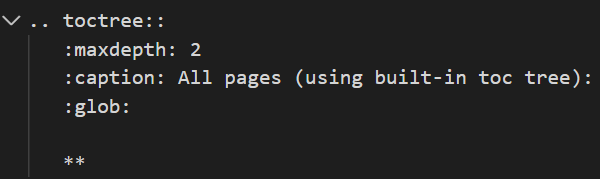
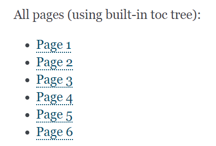
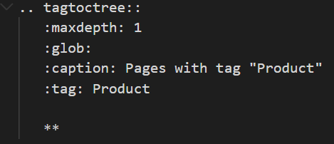
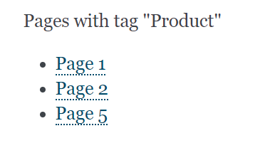

# Sphinx Extension: TagTocTree

This is an extension to the documentation engine [Sphinx](http://www.sphinx-doc.org/).
It allows you to include pages in a table of contents by using tags assigned to a page.

## How it works

This extension adds a new directive `tagtoctree`, which creates a tree-like
table-of-contents, filtering pages by a tag filter.

Directive    |   Configuration                   | Produces                          |
-------------|-----------------------------------|-----------------------------------|
`toctree` (*)|  |  |
`tagtoctree` |  |  |

(*) Sphinx native [`toctree`](https://www.sphinx-doc.org/en/1.8/usage/restructuredtext/directives.html#directive-toctree)

## Installation

The documentation assumes you have a Sphinx project running.

- Install using PIP:

    ```bash
    pip install sphinx-tagtoctree
    ```

- In your Sphinx configuration file (`conf.py`), add an entry for `tagtoctree`:

    ```python
    extensions = [
        'sphinx_tagtoctree'
    ]
    ```

## Configuration options

Configurations that can be added to `conf.py`:

1. `tagtoctree_tag`
- (Optional) Add a configuration value for `tagtoctree_tag`. If none is provided, the default `tagtoctree` will be used. This is the tag you will add to your pages.

   ```python
   tagtoctree_tag = 'tagtoctree'
   ```

2. `tagtoctree_allowed_in_token` 

- (Optional) Add a configuration value for `tagtoctree_allowed_in_token` with a string  
of specials characters that should be allowed in tags. If none is provided, the default `.:_` will be used. 

   ```python
   tagtoctree_allowed_in_token = '.:_-'
   ```

## Usage - simple tags

- For each page, add a header on the top with the values of your tags. See examples [page1](/example/source/page1.rst) and
 [page2](/example/source/page2.rst) in this repo.
     
- Finally, add a `tagtoctree` directive where you want your table-of-contents to be displayed. Example:

  ```rst
    .. tagtoctree::
    :maxdepth: 1
    :glob:
    :caption: Pages with tag "Product"
    :tag: Product

    **
 ```

## Usage - boolean filter

You can specify a more complex filter using boolean expressions.
Examples of valid expressions are:

    * ``(Customer AND Product)`` Include pages with tags Customer and Product. 
    * ``(Customer OR Product) AND NOT(Sales)`` Include pages that have tags Customer or Product, but which do not have tag Sales. Equivalent to ``(Customer OR Product) AND ~ Sales``
    * ``(NOT Customer) AND NOT(Sales)`` Include pages that do have neither Customer nor Product.
    
Examples:

```rst
.. tagtoctree::
   :maxdepth: 1
   :glob:
   :caption: Pages filtered with an expression: (Customer AND Product)
   :tag_expr: Customer AND Product

   **

.. tagtoctree::
   :maxdepth: 1
   :glob:
   :caption: Pages filtered with an expression: (Customer OR Product) AND Sales
   :tag_expr: (Customer OR Product) AND Sales

   **


.. tagtoctree::
   :maxdepth: 1
   :glob:
   :caption: Pages filtered with an expression: (Customer OR Product) AND NOT Sales
   :tag_expr: (Customer OR Product) AND NOT Sales

   **


.. tagtoctree::
   :maxdepth: 1
   :glob:
   :caption: Pages filtered with an expression: (NOT Customer) AND NOT(Sales)
   :tag_expr: (NOT Customer) AND NOT(Sales)

   **
```